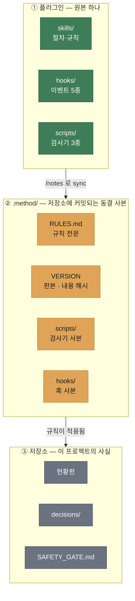
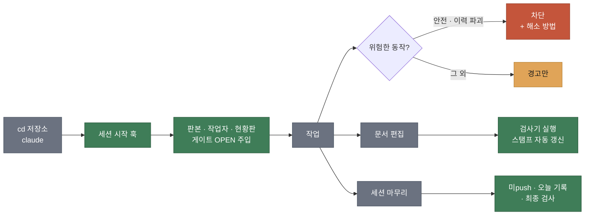

<p align="center">
  
</p>

<p align="center">
  기록은 <strong>현황판 · 결정 기록(ADR) · 아카이브</strong>로 나눠 담고, 사람이 실제로 저지르는 실수는 검사기가 잡는다.<br>
  실장비를 다루는 프로젝트에는 <strong>에이전트가 닫을 수 없는</strong> 안전 게이트를 둔다.
</p>

<p align="center">
  <a href="https://github.com/mongdang/girok/actions/workflows/tests.yml"></a>
  <a href="https://github.com/mongdang/girok/blob/master/.claude-plugin/plugin.json"></a>
  <a href="LICENSE"></a>
  
  
</p>

<p align="center">
  
</p>

<p align="center">
  <sub>도입은 <code>/notes</code> 한 번. <b>뼈대를 만들기 전에 저장소부터 읽고</b>, 이미 쓰고 있는 관례에서 설정을 추론해 제안한다</sub>
</p>

---

## 목차

- [왜 만들었나](#왜-만들었나)
- [어떻게 동작하나](#어떻게-동작하나)
- [빠른 시작](#빠른-시작)
- [하루 흐름](#하루-흐름)
- [구성 요소](#구성-요소)
- [무엇을 막고 무엇을 경고하나](#무엇을-막고-무엇을-경고하나)
- [설정](#설정)
- [기존 파일을 건드리나](#기존-파일을-건드리나)
- [하지 않는 것](#하지-않는-것)
- [요구사항](#요구사항)
- [개발](#개발)
- [라이선스](#라이선스)

---

## 왜 만들었나

문서 규칙을 정하는 일 자체는 어렵지 않다. 문제는 그 규칙을 **두 번째 저장소에 복사하는
순간**부터 생긴다.

이 플러그인이 나온 프로젝트에서 실제로 겪은 일이다. "빈 줄로 끊긴 GFM 표"를 잡는 검사를
검사기에 추가했다 — 같은 실수로 이미 세 번 사고가 난 뒤였다. 그런데 그 개선은 **다른
저장소로 전파되지 않았다.** 아무도 몰랐다. 지켜보는 것이 없었기 때문이다.

사본은 반드시 어긋난다. 조심한다고 잡히는 문제가 아니라, 구조로 잡아야 하는 문제다.

## 어떻게 동작하나

규칙 원본은 플러그인 한 곳에만 둔다. 각 저장소에는 그 판본의 **동결 사본이 커밋**되므로,
플러그인 없이 저장소만 받아도 규칙 전문을 읽을 수 있다.



이 방법론이 여느 플러그인과 갈라지는 지점이 ② 계층이다.

| | |
|---|---|
| **clone만 해도 규칙이 보인다** | `.method/RULES.md` 를 읽는 데 플러그인이 필요 없다. Gemini CLI·Codex 도 같은 파일을 읽는다 |
| **플러그인 없이도 검사가 돈다** | 훅은 저장소의 `.claude/settings.json` 이 등록한다. 플러그인은 도입·갱신에만 있으면 된다 |
| **커밋 이력에 판본이 남는다** | `.method/VERSION` 이 그 규칙이 적용된 작업과 같이 커밋된다 |
| **어긋나면 보인다** | 세션 시작 시 스냅샷과 설치된 플러그인 판본을 대조해 알려준다 |
| **CI가 강제한다** | 스냅샷 내용이 `VERSION` 에 적힌 해시와 맞아야 한다 — 손으로 고친 스냅샷은 push 에서 걸린다 |

> [!IMPORTANT]
> `.method/` 는 사람이 손대지 않는다. 개정은 항상 플러그인 원본에서 하고, sync 로 내려받는다.
> 손대면 사본이 다시 갈라지고, 그게 이 프로젝트가 없애려는 바로 그 문제다.

## 빠른 시작

### 1단계 · 플러그인 설치 (도입·갱신용, 머신당 1회)

```bash
claude plugin marketplace add mongdang/girok
claude plugin install girok@mongdang
```

Claude Code 안에서라면 `/plugin marketplace add mongdang/girok` → `/plugin install girok@mongdang`.
설치 후 **Claude Code 를 껐다 켠다** — 훅은 세션이 시작할 때 붙는다.

이미 깔려 있다면 갱신도 같은 자리다. 설치본은 버전별 폴더에 캐시되므로 명령 없이는
옛 사본을 계속 쓴다.

```bash
claude plugin marketplace update mongdang
claude plugin update girok@mongdang
```

> [!IMPORTANT]
> **0.18 이하를 쓰던 저장소는 저장소마다 `/notes` 를 한 번 돌려야 한다.** 0.19.0 부터
> 훅 등록은 플러그인이 아니라 저장소의 `.claude/settings.json` 에 있다. 플러그인만
> 갱신하고 `/notes` 를 돌리지 않으면 플러그인은 더 이상 훅을 들고 있지 않고 저장소에는
> 아직 등록이 없어 **검사가 아무 데서도 돌지 않는다.** 돌린 결과(`.method/` 와
> `.claude/settings.json`)를 커밋하면 팀원 머신에도 그대로 걸린다.
> 0.20.0 부터는 같은 `/notes` 가 `CLAUDE.md` 의 게이트 문언까지 맞춘다 — 손으로 고쳐 쓴
> 게이트는 알아보지 못했다고 말하고 그대로 둔다.

> [!TIP]
> **이미 girok 이 들어간 저장소에서 작업만 할 거라면 이 단계는 필요 없다.** 훅·검사기·규칙
> 전문이 저장소에 함께 커밋돼 있고, 훅 등록도 저장소의 `.claude/settings.json` 에 있다.
> 폴더 신뢰를 승인하고 Python 3.10+ 만 있으면 같은 검사가 그대로 돈다. 플러그인이 필요한
> 것은 **저장소를 새로 도입할 때(2단계)와 규칙 개정을 내려받을 때** 다.

> [!NOTE]
> 폴더를 신뢰하면 저장소에 커밋된 설정에서 마켓플레이스가 자동 등록된다. 다만 커밋된
> `enabledPlugins` 만으로는 헤드리스 세션에서 **설치까지 되지는 않았다**. 대화형에서
> 설치 프롬프트가 뜨는지는 아직 확인하지 못해, 위 명령을 안내에 남겨둔다.

### 2단계 · 저장소에 도입 (저장소당 1회)

```
/notes
```

`/notes` 는 뼈대를 만들기 전에 **저장소부터 읽는다.** 이미 쓰고 있는 관례에서 설정을
추론하고, 정리할 것을 알려준다 — 현황판이 어느 파일인지, 결정 기록이 어디 있는지, 크기를
넘긴 문서가 있는지. 이 단계는 읽기만 하며, 결과는 어디까지나 제안이다.

```
저장소: eq-agent · 문서 75건

제안하는 설정:
  진행기록 위치  .
  현황판        STATE.md
  결정 기록      decisions (numbered)
  안전 게이트    켬
  아카이브       끔        ← CLAUDE.md 가 "아카이브 폴더를 만들지 않는다" 고 못 박아 둠
  병행 작업      끔

살펴볼 것 4건:
  - `METHOD.md` 크기가 20,090바이트로 기준(20,000)을 넘는다 — 아카이브로 옮길 때다
  - 커밋 이메일이 4개다 — 사람이 여럿이면 병행 작업을 켜고 workers 를 채울 것
  ...
```

그다음 무엇을 만들지 확인을 받는다. 답하면 나머지는 알아서 만들어진다.

<p align="center">
  
</p>

만들어진 결과는 **커밋한다.** 특히 `.claude/settings.json` 이 커밋돼야 **팀원의 머신에서
훅이 걸린다** — 훅 등록이 그 파일에 들어 있고, 그래서 플러그인이 없는 사람에게도 같은
검사가 적용된다.

### 3단계 · 작업

```bash
cd <저장소 폴더>
claude
```

이것으로 끝이다. 따로 칠 명령은 없다. 세션이 시작되는 시점에 규칙 판본·작업자·현황판
상태·열린 게이트 항목을 이미 파악한 상태다.

<p align="center">
  
</p>

> 매일 쓰는 법·막혔을 때·문제 해결은 **[사용법 문서](docs/%EC%82%AC%EC%9A%A9%EB%B2%95.md)** 에 따로 있다.

## 하루 흐름



## 구성 요소

<table>
<tr><th align="left" width="180">스킬</th><th align="left">담는 것</th></tr>
<tr><td><code>project-notes</code></td><td>세션 절차, 문서별 역할 분담, 커밋·push 규칙</td></tr>
<tr><td><code>progress-board</code></td><td>현황판을 누적 로그가 아니라 <b>지금 상태의 스냅샷</b>으로 유지하는 법</td></tr>
<tr><td><code>writing-adr</code></td><td>어떤 결정이 ADR 인가, 카드 형식, supersede 절차</td></tr>
<tr><td><code>doc-style</code></td><td>문서 구조, 콜아웃, 상태 배지, 표·이미지 규칙</td></tr>
<tr><td><code>parallel-docs</code></td><td>개인 폴더, 스탬프, 반입 스캔, 병합 순서</td></tr>
<tr><td><code>safety-gate</code></td><td>게이트 항목, 마커 규칙, 배포 기록 <em>(옵션 모듈)</em></td></tr>
</table>

<table>
<tr><th align="left" width="180">훅</th><th align="left">하는 일</th></tr>
<tr><td><code>SessionStart</code></td><td>검사를 <b>대신 실행해서</b> 결과를 주입한다. ready 마커도 여기서 나온다</td></tr>
<tr><td><code>UserPromptSubmit</code></td><td>원점복귀·모션 얘기가 나오면 그 자리에서 열린 게이트 항목을 띄운다</td></tr>
<tr><td><code>PreToolUse</code></td><td>막을 값어치가 있는 것만 막고, 나머지는 경고한다</td></tr>
<tr><td><code>PostToolUse</code></td><td>방금 쓴 문서를 검사하고, 수정 스탬프를 <b>시스템 시계로</b> 갱신한다</td></tr>
<tr><td><code>Stop</code></td><td>미push 커밋, 오늘 로그 누락, 깨진 채로 남은 문서</td></tr>
</table>

<table>
<tr><th align="left" width="180">검사기</th><th align="left">잡는 것</th></tr>
<tr><td><code>check_docs.py</code></td><td>죽은 목차 앵커 · 빈 줄로 끊긴 표 · <b>단독 캐리지 리턴</b> · 없는 결정 인용 · 인덱스 미등재 · <b>목차 누락</b> · <b><code>---</code> 로 시작하는 문서</b> · <b>확인자·날짜 없는 CLOSED 게이트 항목</b> · 로컬 절대경로 · 문서 크기 초과</td></tr>
<tr><td><code>marker_scan.py</code></td><td>게이트에 등재되지 않은 <code>SAFETY-STUB</code> · <code>VIRTUAL-BYPASS</code></td></tr>
<tr><td><code>method_sync.py</code></td><td><code>.method/</code> 스냅샷 생성과 무결성 검증</td></tr>
<tr><td><code>notes_survey.py</code></td><td>도입 전 저장소 조사 — 기존 관례에서 설정을 추론하고 정리할 것을 보고한다 (읽기 전용)</td></tr>
<tr><td><code>notes_adopt.py</code></td><td>기존 기록을 girok 자리로 이식 — <code>backup</code>·<code>plan</code>·<code>apply</code>·<code>verify</code> 순으로 백업·목록화·이동·검증한다</td></tr>
</table>

검사기는 **커밋된 스냅샷에서** 돌기 때문에 CI에 아무것도 설치할 필요가 없다.

```bash
python <진행기록폴더>/.method/scripts/check_docs.py
python <진행기록폴더>/.method/scripts/marker_scan.py
python <진행기록폴더>/.method/scripts/method_sync.py verify
```

<p align="center">
  
</p>

바로 쓸 수 있는 워크플로가 [`ci/github-actions.yml`](ci/github-actions.yml) 에 있다.
훅은 빠른 피드백, **CI가 보증**이다 — Python 이 없는 머신, 다른 에이전트, 웹 UI 편집은
훅을 그냥 통과하기 때문이다.

## 무엇을 막고 무엇을 경고하나

차단은 **안전과 이력 파괴, 두 부류에만** 쓴다. 나머지는 전부 경고다. 평범한 작업을 막는
검사는 결국 꺼지고, 꺼진 검사는 아무것도 지키지 못한다.

| | 동작 | 이유 |
|---|---|---|
|  | 게이트 OPEN 중 실장비 모션 명령 | 사고 비용이 자동화 편익과 비교 불가 |
|  | 에이전트가 게이트 **확인자 칸**을 채우려는 시도 | 실장비 검증을 AI가 대신할 수 없다 |
|  | 마커 추가 + 같은 커밋에 게이트 등재 없음 | 등재 안 된 안전 우회가 커밋되는 것을 막는다 |
|  | `--force` push — **`+refspec` 형태 포함** | 변경 이력 자체가 결정 기록이다. 이유를 담으면 통과한다(아래) |
|  | 참고 저장소에 push | 대조·이식 출처로만 쓰는 저장소다 |
|  | `.method/` 직접 수정 | 손대면 사본이 다시 갈라진다 |
|  | 작업자 미확정 상태의 **문서 쓰기 · 커밋 · push** | 잘못된 id 로 기록되면 병합 때 남의 기록에 섞인다 |
|  | 병행 기간에 메인 `docs/` 쓰기 | 예외: 안전 게이트·기계적 정합화 |
|  | 문서에 새 로컬 절대경로 기록 | 머신마다 달라진다 |
|  | 문서 크기 한계 초과 | 완결된 서사를 아카이브로 옮길 때다 |

> [!WARNING]
> **마커 검사는 편집 시점이 아니라 `git commit` 시점**에 스테이징된 diff를 대상으로 한다.
> 편집에서 막으면 "마커를 먼저 넣고 게이트에 등재한다"는 정상 순서가 차단되고, 사람들은
> 훅을 우회하는 법을 배우게 된다.

### 규칙을 어겨야 할 때

force push 는 막혀 있다. 정말 해야 하면 **이유를 담아** 실행한다:

<p align="center">
  
</p>

```bash
GIROK_FORCE_PUSH_REASON="이력 리셋 — 사용자 지시 2026-09-01" git push origin +master
```

스위치가 아니라 이유다(8자 이상). 훅이 그 이유를 세션에 그대로 남기므로, 규칙을 어긴
사실과 근거가 기록에 남는다. 대안이 있으면 그쪽이 낫다 — 트리 불변 커밋(`-s ours`
조상 연결)은 tip 을 원하는 커밋으로 만들면서 이력을 지우지 않는다.

> [!NOTE]
> `+master` 같은 refspec 형태도 force push 다. 처음에는 플래그만 잡아서 이 형태로
> 가드가 뚫렸다 — 만든 사람만 아는 구멍은 없는 가드보다 나쁘다.

## 설정

프로젝트마다 다른 값은 커밋되는 파일 하나, `.claude/girok.json` 에 모인다.

```json
{
  "notesDir": "notes",
  "workers": { "abc": "abc@example.com" },
  "mergeOwner": "abc",
  "modules": { "safetyGate": true, "archive": true },
  "limits": { "rulesKB": 20, "boardKB": 30 },
  "parallelMode": true,
  "readOnlyRepos": []
}
```

| 키 | 기본값 | 설명 |
|---|---|---|
| `notesDir` | `"notes"` | 진행기록 트리 위치. `"."` 이면 저장소 루트 |
| `remote` | `"origin"` | 반입 스캔에 쓸 원격 이름 |
| `board` | `"PROGRESS.md"` | 현황판 파일명 |
| `decisionsDir` | `"docs/decisions"` | 결정 기록 폴더 |
| `docRoots` | `["docs"]` | 재귀적으로 검사할 폴더 |
| `rootDocs` | `["CLAUDE.md", "RULES.md"]` | 진행기록 루트에서 **비재귀**로 검사할 문서 |
| `rulesDocs` | `["CLAUDE.md", "RULES.md"]` | `rulesKB` 한계를 적용할 문서 |
| `adrStyle` | `"adr-prefixed"` | `ADR-NNN-slug.md`. `"numbered"` 면 `NNN-slug.md` |
| `workers` | `{}` | 작업자 id → git 이메일. **비어 있으면 문서 쓰기·커밋이 막힌다** (아래 참고) |
| `mergeOwner` | `null` | master 병합·push 를 맡는 사람 |
| `modules.safetyGate` | `true` | 하드웨어 없는 프로젝트면 끈다 |
| `modules.archive` | `true` | "지운 건 git 히스토리에 있다" 관례면 끈다 |
| `parallelMode` | `true` | 단독 작업 저장소면 끈다 |
| `readOnlyRepos` | `[]` | push 를 막을 참고 저장소 목록 |
| `skipDirs` | `[]` | 검사기가 건너뛸 폴더 — 규칙 도입 전에 쓰인 동결 산출물용 |
| `limits.tocMinKB` | `1.5` | 목차를 요구하는 최소 문서 크기 |

> [!NOTE]
> `pluginConfigs` 키는 스코프가 **User or managed** 라 저장소에 커밋해도 무시된다.
> 저장소별 설정을 담을 수 있는 길은 이 파일뿐이다.

### `workers` 는 채워야 진행된다

병행 모드(`parallelMode: true`)에서 내 `git user.email` 이 `workers` 에 없으면, 세션이 누구인지
묻고 **답이 설정에 기록되기 전까지 문서 쓰기·커밋·push 가 차단된다.**

```json
"workers": { "abc": "abc@example.com", "xyz": "xyz@example.com" }
```

| | |
|---|---|
| **왜 막나** | 잘못된 id 로 기록되면 병합할 때 남의 기록에 섞인다. 나중에 되돌리기 어렵다 |
| **무엇이 "확정"인가** | 이 파일에 매핑이 생기는 것. 세션 안에만 있는 상태가 아니라 **언제든 확인 가능한 사실**이다 |
| **막히지 않는 것** | 코드 편집 (기록이 아니다) · `girok.json` 자체 (답을 적어야 하니까) · `SAFETY_GATE.md` (안전 정보는 기다리지 않는다) |
| **해소** | 위처럼 한 줄 추가하면 그 순간부터 확정된다 |

혼자 쓰는 저장소라면 `parallelMode: false` 로 두면 된다 — 이 절차 전체가 꺼진다.

### 자기 레이아웃만 고집하지 않는다

두 번째로 도입한 저장소는 레이아웃이 달랐다. 결정 파일 52개의 이름을 전부 바꾸는 비용이
얻는 것보다 컸고, 그래서 **레이아웃은 가정이 아니라 설정**이 됐다.

| | 진행기록이 하위 폴더 | 진행기록이 루트 |
|---|---|---|
| 현황판 | `notes/docs/PROGRESS.md` | `STATE.md` |
| 결정 기록 | `notes/docs/decisions/ADR-001-slug.md` | `decisions/001-slug.md` |
| 설정 | `"notesDir": "notes"` | `"notesDir": "."` · `"board": "STATE.md"` · `"decisionsDir": "decisions"` · `"adrStyle": "numbered"` |

## 기존 파일을 건드리나

도입할 때 가장 먼저 나오는 질문이라, 쓰기 경로를 빠짐없이 정리해 둔다.

| 대상 | 답 |
|---|---|
| **소스 코드** | 절대 건드리지 않는다. 코드를 쓰는 경로가 아예 없다 |
| **기존 문서** | **덮어쓰지 않는다.** 초기화는 파일이 이미 있으면 `[유지]` 로 보고하고 넘어간다 |
| **기존 폴더 구조** | 바꾸지 않는다. 설정 파일이 이미 있으면 그 레이아웃을 따른다 |
| **git 이력** | 커밋·push·리셋을 하지 않는다. git 은 읽기 명령만 쓴다(`config`·`rev-parse`·`rev-list`·`diff --cached`) |

새로 **만드는** 것은 없던 경우에만: `.claude/settings.json` · `.claude/girok.json` ·
진행기록 뼈대(`CLAUDE.md`·현황판·`decisions/README.md`) · `.method/`.

**지우는 곳은 `<진행기록폴더>/.method/` 한 곳뿐이다.** sync 는 그 폴더를 지우고 다시
만든다. 다른 용도로 쓰이던 `.method/` 를 잃지 않도록, **그 폴더가 이 플러그인이 만든
것임을 `VERSION` 으로 확인하지 못하면 지우지 않고 멈춘다.**

**기존 문서를 수정하는 경로도 한 곳뿐이다** — 병행 관리 문서의 `> 최종 수정:` 스탬프 한 줄.
그 줄이 이미 있는 문서에만, 그 줄만 바꾸고, 파일의 줄바꿈 방식(CRLF/LF)도 그대로 둔다.
스탬프가 없는 문서는 아예 쓰지 않는다.

> [!WARNING]
> 이 스탬프 갱신에 두 개의 버그가 있었고 v0.6.0 에서 고쳤다 — 정규식이 스탬프 **다음 빈
> 줄까지 삼켜** 갱신마다 한 줄씩 사라졌고, CRLF 파일을 LF 로 바꿔 한 줄 변경이 파일 전체
> diff 로 보였다. 지금은 둘 다 테스트로 고정돼 있다.

초기화 명령은 **`--confirm <저장소 폴더 이름>`** 없이는 아무것도 만들지 않는다. 참고용
저장소나 "손대지 않기로 한" 저장소라는 사실은 저장소 안 어디에도 적혀 있지 않으므로,
부르는 쪽이 어느 저장소에 쓰려는 것인지 이름으로 밝혀야 한다.

## 하지 않는 것

기능 목록보다 이쪽이 더 중요하다.

- **안전 게이트 항목을 닫지 않는다.** 게이트는 사람 확인자만 닫는다. 에이전트는 실장비
  검증을 대신할 수 없고, 훅은 확인자 칸을 채우는 시도 자체를 막는다.
- **승인 없이 병합하지 않는다.** 문서 자동 병합은 의도적으로 미뤄 둔 2차 과제다 —
  위험은 대부분 거기에 있는데, 정작 이 프로젝트가 풀려는 문제와는 무관하기 때문이다.
- **사람의 실수까지 막아 주지는 못한다.** 훅은 에이전트가 실행하는 경로만 본다. 사람이
  장비 콘솔에서 직접 축을 움직이는 것은 아무것도 막지 못한다.
- **무엇을 기록할지는 정해 주지 않는다.** 어디에 어떤 형식으로 남길지만 정한다.
- **저장소 안의 위조까지 잡지는 못한다.** CI 의 `verify` 는 스냅샷이 자기 `VERSION` 과
  맞는지를 본다. 훅과 해시를 **함께** 고치면 통과한다 — CI 에는 플러그인이 없어서 원본과
  대조할 수단이 없기 때문이다. 원본과 같음을 보증하는 것은 플러그인이 있는 머신의 `sync`
  이고, 저장소에 커밋된 코드를 실행하는 결정은 폴더 신뢰 승인이다. 신뢰하지 않는 저장소는
  신뢰하지 말 것.

## 요구사항

**Python 3.10 이상**과 **git**. 이 둘이 전부다. 플러그인은 도입·갱신에만 필요하다.

Python 이 없는 머신에서는 훅이 돌지 않는다. 래퍼가 그 사실을 stderr 로 말하고 끝내며,
세션 시작 블록이 뜨지 않으므로 `CLAUDE.md` 게이트가 작업을 멈춘다. 그 환경에 남는 것은
규칙 전문(사람이 읽고 따르는 것)과 CI(사후 거부)뿐이다 — 사전 차단은 없다.

훅도 검사기도 전부 Python 이고, 진입점은 bash·cmd.exe·PowerShell 셋 다에서 도는 폴리글롯
래퍼다 — Git Bash 가 없는 Windows 에서 Claude Code 가 PowerShell 로 훅을 띄우는 경우까지
포함해 세 경로를 전부 실측했다. 래퍼는 인터프리터를 이름만 보고 고르지 않고 **직접
실행해** 확인한다. Windows 에서 `python3` 는 보통 인터프리터가 아니라 Microsoft Store
바로가기로 잡히는데, 그걸 골랐다가 훅이 조용히 전부 죽었던 적이 있기 때문이다.

## 개발

```bash
pip install -r requirements-dev.txt
python -m pytest -q
```

CI는 Linux와 Windows 양쪽에서 돈다. 줄바꿈, 콘솔 인코딩, 인터프리터 탐색 — 셋 다 두
환경에서 다르게 동작했고, 그 차이를 사용자보다 테스트가 먼저 찾아냈다.

> [!IMPORTANT]
> **배포되는 변경마다 `.claude-plugin/plugin.json` 의 `version` 을 올린다.**
> 설치본은 버전 디렉터리에 캐시되므로, 버전을 그대로 두면 이미 설치한 머신은 처음 받은
> 사본을 계속 쓴다. 마켓플레이스를 갱신해도 바뀌지 않는다.

변경 내역은 [CHANGELOG.md](CHANGELOG.md), 규칙 개정이 여기서 각 저장소까지 어떻게 도달하는지는
[CONTRIBUTING.md](CONTRIBUTING.md) 참고.

## 라이선스

MIT — [LICENSE](LICENSE)
